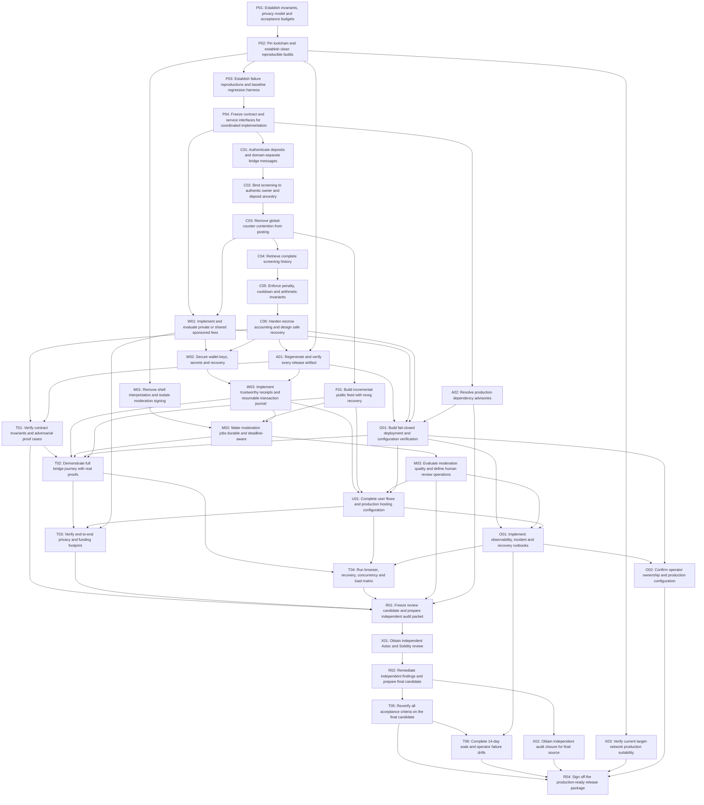

# Execution graph

Generated from graph.json. Each arrow is a required prerequisite.

## Work packages

| ID | Package | Prerequisites | Kind |
|---|---|---|---|
| [P01](tasks/P01.md) | Establish invariants, privacy model and acceptance budgets | none | internal |
| [P02](tasks/P02.md) | Pin toolchain and establish clean reproducible builds | P01 | internal |
| [P03](tasks/P03.md) | Establish failure reproductions and baseline regression harness | P02 | internal |
| [P04](tasks/P04.md) | Freeze contract and service interfaces for coordinated implementation | P03 | internal |
| [C01](tasks/C01.md) | Authenticate deposits and domain-separate bridge messages | P04 | internal |
| [C02](tasks/C02.md) | Bind screening to authentic owner and deposit ancestry | C01 | internal |
| [C03](tasks/C03.md) | Remove global-counter contention from posting | C02 | internal |
| [C04](tasks/C04.md) | Retrieve complete screening history | C03 | internal |
| [C05](tasks/C05.md) | Enforce penalty, cooldown and arithmetic invariants | C04 | internal |
| [C06](tasks/C06.md) | Harden escrow accounting and design safe recovery | C05 | internal |
| [A01](tasks/A01.md) | Regenerate and verify every release artifact | C06, P02 | internal |
| [W01](tasks/W01.md) | Implement and evaluate private or shared sponsored fees | P04, C03 | internal |
| [W02](tasks/W02.md) | Secure wallet keys, secrets and recovery | W01, C06 | internal |
| [W03](tasks/W03.md) | Implement trustworthy receipts and resumable transaction journal | W02, A01 | internal |
| [F01](tasks/F01.md) | Build incremental public feed with reorg recovery | C03 | internal |
| [M01](tasks/M01.md) | Remove shell interpretation and isolate moderation signing | P02 | internal |
| [M02](tasks/M02.md) | Make moderation jobs durable and deadline-aware | M01, F01, W03 | internal |
| [M03](tasks/M03.md) | Evaluate moderation quality and define human review operations | M02 | internal |
| [D01](tasks/D01.md) | Build fail-closed deployment and configuration verification | A01, W01, C06, A02 | internal |
| [U01](tasks/U01.md) | Complete user flows and production hosting configuration | W03, F01, M03, D01 | internal |
| [O01](tasks/O01.md) | Implement observability, incident and recovery runbooks | D01, M03, U01 | internal |
| [T01](tasks/T01.md) | Verify contract invariants and adversarial proof cases | C06, A01 | internal |
| [T02](tasks/T02.md) | Demonstrate full bridge journey with real proofs | T01, W03, M02, D01, F01 | internal |
| [T03](tasks/T03.md) | Verify end-to-end privacy and funding footprint | T02, U01, W01 | internal |
| [T04](tasks/T04.md) | Run browser, recovery, concurrency and load matrix | T02, U01, O01 | internal |
| [R01](tasks/R01.md) | Freeze review candidate and prepare independent audit packet | T01, T03, T04, M03, A02 | internal |
| [X01](tasks/X01.md) | Obtain independent Aztec and Solidity review | R01 | external |
| [R02](tasks/R02.md) | Remediate independent findings and prepare final candidate | X01 | internal |
| [X02](tasks/X02.md) | Obtain independent audit closure for final source | R02 | external |
| [T05](tasks/T05.md) | Reverify all acceptance criteria on the final candidate | R02 | internal |
| [T06](tasks/T06.md) | Complete 14-day soak and operator failure drills | T05, O01 | internal |
| [X03](tasks/X03.md) | Verify current target-network production suitability | P02 | external |
| [O02](tasks/O02.md) | Confirm operator ownership and production configuration | O01, D01 | external |
| [R04](tasks/R04.md) | Sign off the production-ready release package | T05, T06, X02, X03, O02 | internal |
| [A02](tasks/A02.md) | Resolve production dependency advisories | P04 | internal |
